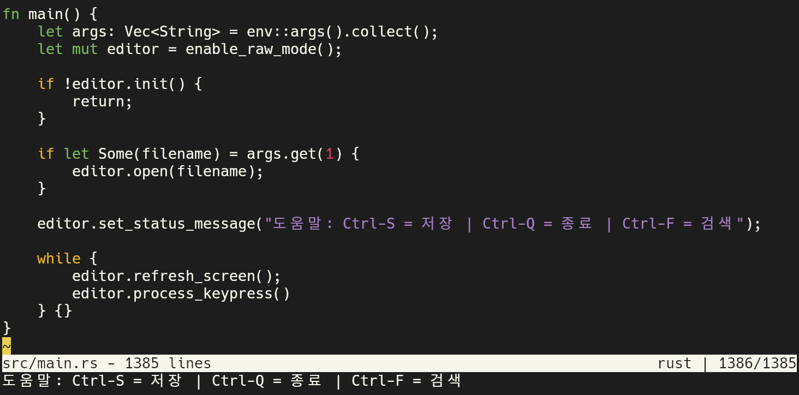

# Editor



## Code

| lang | file                        |
| ---- | --------------------------- |
| Rust | [main.rs](rust/src/main.rs) |
| C    | [kilo.c](c/kilo.c)          |

## Build and Run

### Rust Editor

```bash
cargo run -- src/main.rs
```

### C Editor

```bash
make
./kilo kilo.c
```

______________________________________________________________________

## Ref

- kilo: [github](https://github.com/antirez/kilo)
  - [Blog](http://antirez.com/news/108): Writing an editor in less than 1000
    lines of code, just for fun
  - [Tutorial](https://viewsourcecode.org/snaptoken/kilo/): Build Your Own Text
    Editor
- [Avery Laird](https://www.averylaird.com/programming/the%20text%20editor/2017/09/30/the-piece-table):
  Text Editor - Data Structures
- [Cameron DaCamara](https://cdacamar.github.io/data%20structures/algorithms/benchmarking/text%20editors/c++/editor-data-structures/):
  Text Editor Data Structures
- [Tsoding Daily](https://youtu.be/2UY_Am-Q-oI): Writing Text Editor
